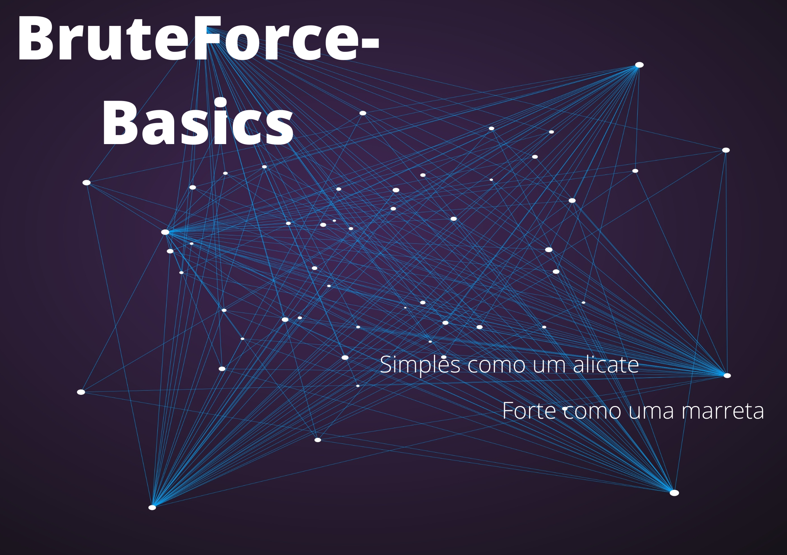

  Algoritmo simples para testagem de combinações alfanuméricas com até 5 digitos.
  
  >O código solicita ao usuário uma entrada de texto que será comparada com as combinações geradas pelo programa, se a combinação for igual a entrada o programa imprime o valor gerado e encerra.
